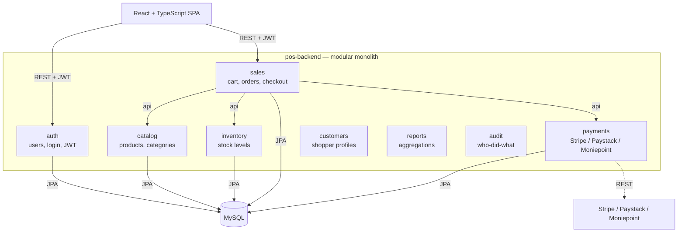

# POS Management System

A full-stack **Point of Sale (POS)** system for malls, supermarkets, and retail chains.
Backend is a **modular monolith** built with Spring Boot + Spring Modulith; frontend is
React + TypeScript. Payments go through Stripe, Paystack, and Moniepoint (Nigeria-first).

## Tech stack

| Layer | Technology |
|---|---|
| Backend | Java 25, Spring Boot 4.1.1, Spring Modulith 2.1.1 |
| Persistence | MySQL, Spring Data JPA (per-module transactions) |
| Security | Spring Security + JWT (JJWT) |
| Payments | `stripe-java` SDK; Paystack & Moniepoint via REST (`RestClient`) |
| Frontend | React + TypeScript (in `pos-frontend/`, being scaffolded) |
| Deployment | Docker, docker-compose (local), host-agnostic (cloud / on-prem / VPS) |

## Repository layout

```
.
├── pos-backend/    # Spring Boot modular monolith (Maven)
└── pos-frontend/   # React + TypeScript app
```

## Backend architecture (modular monolith)

One deployable, one database — but each business module is a top-level package with an
enforced public `api` sub-package. Modules may only import other modules' `api`;
circular dependencies and illegal imports fail the build via a Modulith verification
test.



> 
## Getting started (backend)

Prerequisites: Java 25, MySQL 8+.

```bash
cd pos-backend
./mvnw spring-boot:run
```

Configuration lives in `pos-backend/src/main/resources/application.properties`
(database URL/credentials, JWT secret, payment keys). A `.env`/`.env.example` pair is
introduced once Docker is wired.
